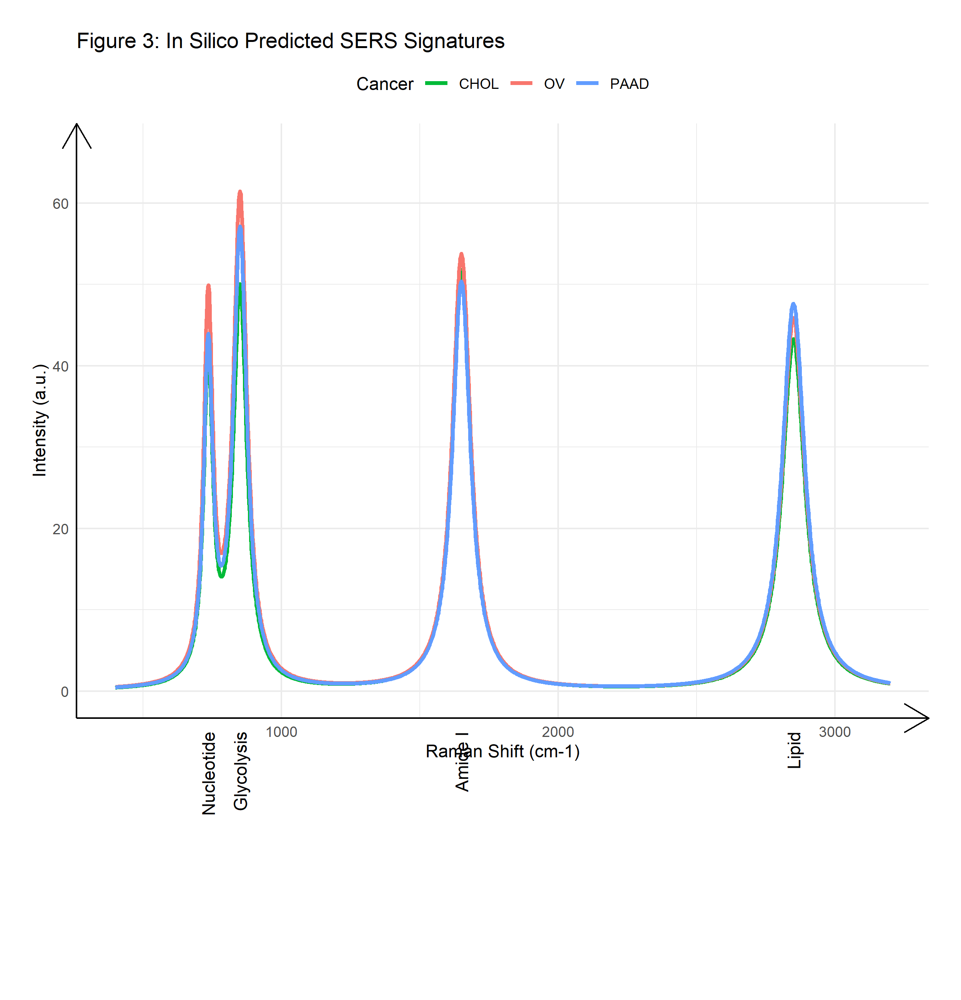

#  Abdominal Kanser Tanısı İçin Transkriptomik Rehberli Yapay Zeka


> **"Gen İfadesinden Girişimsel Olmayan Tanıya"**

## Canlı Demo
Geliştirdiğimiz uygulamayı canlı olarak denemek için tıklayın:
👉 **[Metabolik SERS Tanı Uygulamasını Başlat](https://metabolic-sers-cancer-diagnosis-bux47yoq5ye6algs4howag.streamlit.app/)**

##  İçindekiler
- [Proje Özeti](#-proje-özeti)
- [Problem](#-problem)
- [Çözümümüz](#-çözümümüz)
- [Metodoloji](#-metodoloji)
- [Temel Sonuçlar](#-temel-sonuçlar)
- [Proje Yapısı](#-proje-yapısı)
- [Kurulum & Kullanım](#-kurulum--kullanım)
- [İletişim](#-iletişim)


## Proje Özeti
Bu proje, **Sistem Biyolojisi** ve **Makine Öğrenmesi** disiplinlerini birleştirerek geliştirilmiştir. Transkriptomik verilerden elde edilen metabolik imzaları kullanarak, tanısı zor olan üç abdominal kanser türünün ayırıcı tanısını yapan, açıklanabilir bir Yapay Zeka (XAI) modeli sunar:
1.  **Pankreas Adenokarsinomu (PAAD)**
2.  **Over Seröz Kistadenokarsinomu (OV)**
3.  **Kolanjiyokarsinom (Safra Yolu Kanseri) (CHOL)**

Çalışma, **Yüzeyde Güçlendirilmiş Raman Spektroskopisi (SERS)** sinyallerini *in silico* (bilgisayar ortamında) simüle ederek, yeni nesil ve invaziv olmayan bir sıvı biyopsi yaklaşımı önermektedir.


##  Problem
* **Geç Teşhis:** Bu kanserler karın ağrısı, sarılık gibi örtüşen semptomlar gösterir ve genellikle geç evrelerde fark edilir.
* **İnvaziv İşlemler:** Biyopsi almak zorlu, riskli ve ağrılı bir süreçtir.
* **Düşük Özgüllük:** CA19-9 gibi geleneksel biyobelirteçler, pankreas ve safra yolu tıkanıklıklarını ayırt etmekte yetersiz kalabilir.


##  Çözümümüz
Geleneksel "Kara Kutu" yaklaşımları yerine, **biyoloji odaklı** bir strateji izledik:
1.  **TCGA** (The Cancer Genome Atlas) veritabanından **60.000+ gen** analiz edildi.
2.  **4 Ana Metabolik Yolak** (Glikoliz, Lipid Sentezi, Nükleotit Metabolizması, TCA Döngüsü) belirlendi.
3.  Bu metabolik skorlara dayanarak kanser türünü tahmin eden bir **Random Forest Sınıflandırıcısı** geliştirildi.
4.  Modelin prognostik (sağkalım) değeri **Kaplan-Meier** ve **Cox-LASSO** analizleri ile doğrulandı.


##  Metodoloji

### 1. Veri İşleme (R & Python)
* **Kaynak:** TCGA (n=656 hasta).
* **Ön İşleme:** RNA-Seq sayım verilerinin normalizasyonu (Log2) ve Gen Sembolü notasyonu.
* **Feature Engineering:** Gen ekspresyon matrislerinin yolak aktivite skorlarına dönüştürülmesi.

### 2. Makine Öğrenmesi Hattı (Pipeline)
* **Algoritma:** Random Forest Classifier (n_estimators=100).
* **Validasyon:** %70 Eğitim / %30 Test ayrımı ve Katmanlı Örnekleme (Stratified Sampling).
* **Açıklanabilirlik:** SHAP Analizi ve Permütasyon Özellik Önemi (Hangi metabolik yolun tanıda daha etkili olduğunu gösterir).

### 3. Klinik Validasyon
* **Sağkalım Analizi:** Nükleotit skorunun yaşam süresini öngördüğü kanıtlandı (p=0.0033).
* **Karar Eğrisi Analizi (DCA):** Modelin kullanılmasının klinik net fayda sağladığı gösterildi.


##  Temel Sonuçlar

Modelimiz test setinde olağanüstü performans metriklerine ulaşmıştır:

| Metrik | Skor | Not |
| :--- | :--- | :--- |
| **Doğruluk (Accuracy)** | **%96** | Yüksek genel başarı |
| **AUC (PAAD)** | **0.97** | Mükemmel ayrım gücü |
| **AUC (OV)** | **0.97** | Mükemmel ayrım gücü |
| **AUC (CHOL)** | **0.94** | Azınlık sınıfında güçlü performans |

### Görseller
#### ROC Eğrileri (Tanısal Başarı)


#### In Silico SERS Spektrumu (Sensör Tasarımı)



##  Proje Yapısı

```bash
├── data/
│   └── metabolic_scores_final.csv   # İşlenmiş veri seti
├── images/                          # Yayın kalitesinde grafikler
├── notebooks/                       # Analiz & Modelleme Not Defterleri
├── app.py                           # Streamlit Uygulaması Kaynak Kodu
├── requirements.txt                 # Gerekli Kütüphaneler
└── README.md                        # Proje Dokümantasyonu

